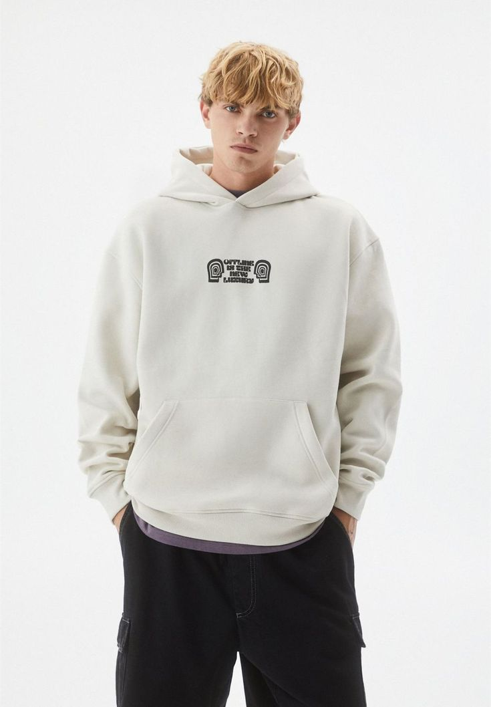
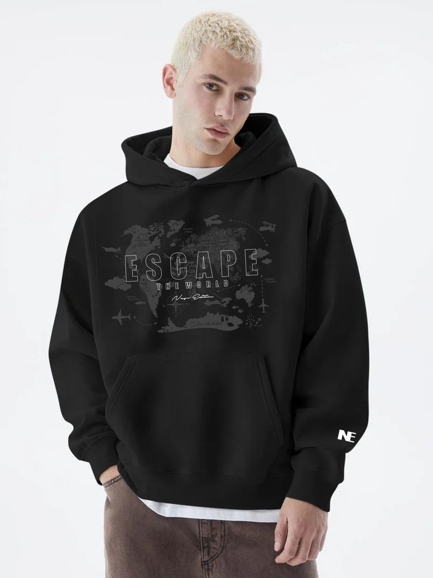
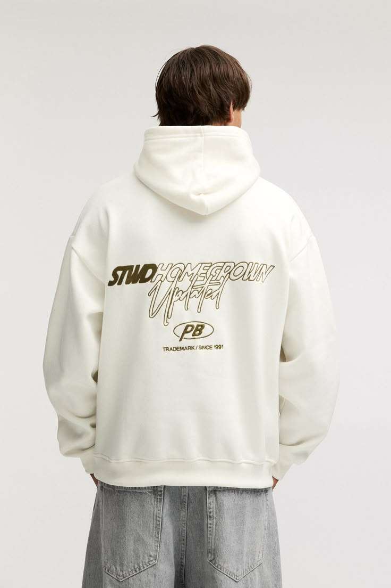
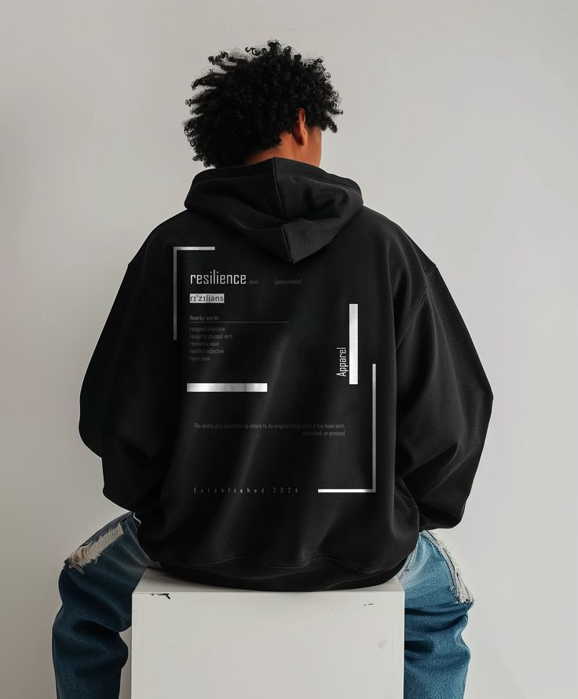

# 🌌 OHANA 626 - Streetwear Experiment 626 🌌



> **ALOHA CHAOS.**  
> Premium streetwear genotypes from District 626, Casablanca. Evolving since 2026.

## 🚀 Quick Start

No build tools needed! Just open in your browser:

```bash
# Open main page
start index1.html
# Or product store
start index2.html
```

Fully responsive across desktop/mobile. Scroll to explore animations!

## 📋 Pages Overview

| Page | Description | Key Features |
|------|-------------|--------------|
| [`index1.html`](./index1.html) | **Home - Collection Grid** | 3D canvas hoodie hero, 6 interactive products, sticky protocol cards, scroll progress |
| [`index2.html`](./index2.html) | **Product Store** | E-commerce detail view, shopping cart, WhatsApp checkout, size selector |
| [`about.html`](./about.html) | **Brand Story** | Vision, protocols, evolution since 2026 |
| [`contact.html`](./contact.html) | **Contact Lab** | Glassmorphism form, WhatsApp/email integration (+212 608173585) |

## ✨ Features

- **Animations**: AnimeJS scroll reveals, canvas 3D hoodie rotation, hover transforms
- **UI/UX**: Glassmorphism (backdrop-blur), neon glows, custom scrollbars, mobile hamburger menu
- **E-Commerce**: Dynamic cart, quantity controls, total calc, WhatsApp order export
- **Responsive**: Mobile-first, Tailwind breakpoints, touch-friendly
- **Performance**: CDN assets, optimized images, lazy hover effects
- **Products**: 18+ pac*.jpeg (hoodies, tees, cargos ~220-450 DH), easy to swap/add

 

## 🛠 Tech Stack

```
Frontend: HTML5 | Tailwind CSS (CDN) | Vanilla JS
Animations: AnimeJS (3.2.1)
Icons: Font Awesome (6.0)
Fonts: Syncopate (display), Inter/Montserrat (body)
Assets: 50+ PNG/JPEG (products, backgrounds, frames)
CDNs: Tailwind, AnimeJS, Google Fonts, CloudFlare
```

- **Custom JS**: `js/app1.js` (home animations/canvas), `js/app2.js` (cart/product switcher)
- **CSS**: Tailwind config (stitch colors: #00a3ff blue, #ff4d6d pink), custom glass effects

## ⚙️ Customization

### Add/Edit Products
1. Duplicate product card in `index1.html` grid
2. Update `pac#.jpeg` path, title, price, description
3. Products auto-index for `openProduct(n)`

### Store Products (`index2.html`)
Edit JS arrays:
```js
// In app2.js - add new product
const products = [
  { id: 0, img: './images/pac1.jpeg', title: 'HEAVY HOODIE', price: 350, ... }
];
```

### Colors/Theme
Tailwind config in `<script>` tags:
```js
colors: { stitch: { blue: '#00a3ff', pink: '#ff4d6d' } }
```

## 🚀 Deployment

Static site - deploy anywhere:

```bash
# Netlify/Vercel: Drag folder
# GitHub Pages: Push to gh-pages branch

# Preview server (optional)
npx serve .
```

## 📞 Base Operations

**District 626, Casablanca, Morocco**

- 📱 **WhatsApp**: [+212 608173585](https://wa.me/212608173585)
- ✉️ **Email**: lab@ohana626.com
- 🌐 **Social**: Instagram/TikTok (add links)

## 🧬 Protocol Complete

```
© 2026 OHANA 626. ALL GENOTYPES RESERVED.
EXPERIMENTING IN URBAN CHAOS.
```



**Built with 🧪 in District 626**

# ohana626-streetwear-lab
